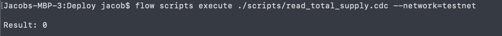
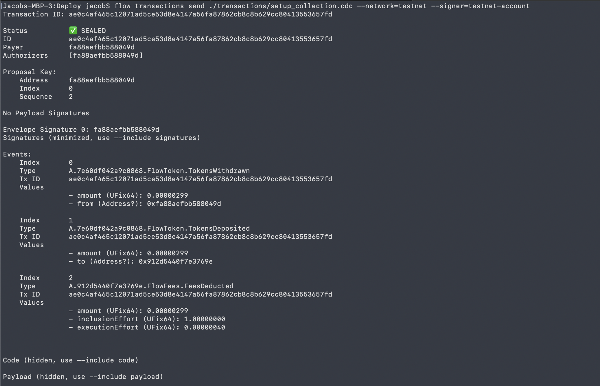

# 第6章2日目 - テストネットでのコントラクトとのやり取り

コントラクトをテストネットにデプロイしたので、ターミナルで Flow CLI を使ってコントラクトとやり取りできます。うぉーーーー！ますます複雑になりそうです。みなさんが超迷子になることを願っています！

今日は少し違います。一緒に何かをすることになるのです。すべての答えを教えるつもりはありません ;)

## コントラクトとのやり取り

コントラクトをテストネットにデプロイしたので、ターミナルで Flow CLI を使ってコントラクトとやり取りできます。

### 総供給量の読み方

スマートコントラクトの総供給量を読み取ってみましょう！

> ステップ1：契約の総供給量を読み取り、それを返すスクリプトを作成します。

> ステップ2：スクリプトを scripts フォルダに貼り付け、名前を `read_total_supply.cdc` とします。

> ステップ3：プロジェクトのベースディレクトリでターミナルを開き、実行します：

```bash
flow scripts execute ./scripts/read_total_supply.cdc --network=testnet
```

正しく動作していれば、コンソールに総供給量が表示されるはずです（まだ何もミントしていない場合は 0 になるはずです）。



### コレクションのセットアップ

トランザクションを実行して、テストネットで NFT コレクションをセットアップしてみましょう。

> ステップ1：まだであれば、NFT を保存するためにユーザーのコレクションをセットアップするトランザクションを行います。

> ステップ2：Transactions フォルダに、Cadence コードを含む `setup_collection.cdc` ファイルを追加します。

> ステップ3：プロジェクトのベースディレクトリでターミナルを開き、実行します：

```bash
flow transactions send ./transactions/setup_collection.cdc --network=testnet --signer=testnet-account
```

正しく機能すれば、トランザクションが封印され（完了し）、機能したことが確認できるはずです！



ナイス――!!! テストネットで NFT コレクションのセットアップに成功しました。これはとてもクールです。

### Flow CLI 使用して引数を渡す方法

これまで、Flow CLI を使用してスクリプトやトランザクションに引数を渡す方法を紹介してきませんでした。

そのためには、トランザクションやスクリプトのファイルパスの後にそれらを置くだけでよいです。

例 #1:

```bash
flow transactions send ./transactions/mint_nft.cdc 0xfa88aefbb588049d --network=testnet --signer=testnet-account
```

`mint_nft.cdc` トランザクションが `recipient: Address` を受け取った場合、`0xfa88aefbb588049d`となります。

例 #2:

```bash
flow scripts execute ./scripts/read_nft.cdc 0xfa88aefbb588049d 3  --network=testnet
```

もし `read_nft.cdc` スクリプトが `recipient: Address, id: UInt64` を受け取った場合、`0xfa88aefbb588049d` と `3` になります。

例 #3:

```bash
flow transactions send ./transactions/mint_nft.cdc 0xfa88aefbb588049d "Jacob the Legend" --network=testnet --signer=testnet-account
```

`mint_nft.cdc` トランザクションが `recipient: Address, name: String` を受け取った場合、`0xfa88aefbb588049d` と `Jacob the Legend` となります。

## まとめ

今日も盛りだくさんでしたが、これはなんとクールなことでしょう！私たちは Flow テストネットに自分たちのコントラクトをデプロイし、スクリプトを実行して `totalSupply` を読み取り、トランザクションを実行してコレクションをセットアップしました。みんな、すごいことをやっています！

## クエスト

1. 今日コレクションをセットアップしたときに行ったように、Flow CLI を使用してトランザクションを送信し、自分自身に NFT をミントする方法を見つけます。また、引数も渡さなければならない可能性が高いです。

*役に立つヒント #1*：`Minter` リソースにアクセスできるのはコントラクトの所有者のみであることを忘れないでください。なぜなら、トランザクションの `signer` はコントラクトをデプロイした人なので、 `Minter` にアクセスできるからです。

*役に立つヒント #2*：また、コレクションをセットアップするには、トランザクションが自分の `AuthAccount` にアクセスできるようにトランザクションに署名する必要があることを覚えておいてください。この場合、作成されたテストネットアカウントは 1 つしかないため（コントラクトをデプロイしたアカウント）、NFT を簡単に作成するために自分自身にミントを作成します。

2. Flow CLI を使用して、新しい `totalSupply` を読み込むスクリプトを実行します。

3. Flow CLI を使用して、誰かのコレクション内の NFT の ID を読み取るスクリプトを実行します。

4. Flow CLI を使用して、誰かのコレクションから特定の NFT のメタデータを読み取るスクリプトを実行します。

5. スクリプトを実行して、**Flow メインネット** 上の GoatedGoats `totalSupply` を読み込みます。彼らのコントラクトはここにあります： https://flow-view-source.com/mainnet/account/0x2068315349bdfce5/contract/GoatedGoats

*役に立つヒント #1*：メインネット上でスクリプトを実行するには、`--network=testnet` フラグを `--network=mainnet` に切り替えるだけでよいです。

*役に立つヒント #2*：ローカルファイルからスクリプトを実行するので、GoatedGoats コントラクトのメインネットアドレスをスクリプトにハードコードする必要があります：
```cadence
import GoatedGoats from 0x2068315349bdfce5
```

残念ながら、コンパイルエラーが発生します（VSCodeエクステンションがインポートを理解できないです）。

6. 誰かのコレクションから GoatedGoats NFT を読み取る方法を見つけ、Flow CLI を使用してスクリプトを実行する。
